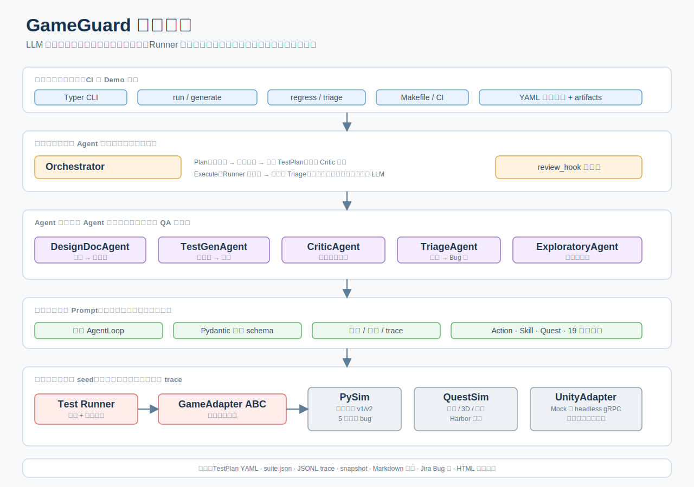
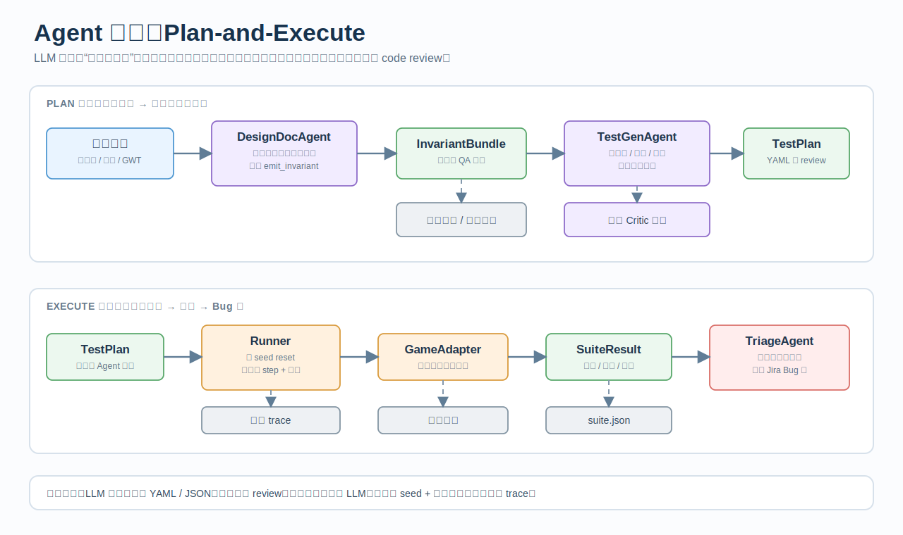
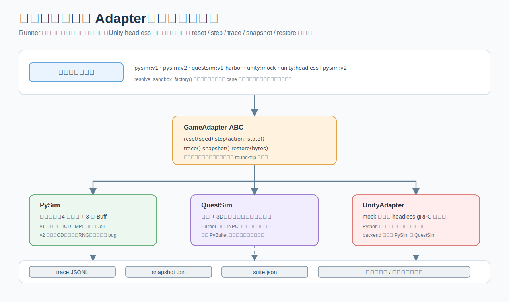
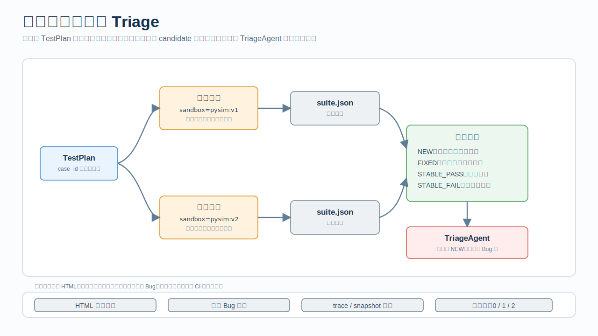

# GameGuard

> **LLM Agent 驱动的游戏自动化测试系统。**
>
> 读策划文档 → Agent 抽机器可验证不变式 → Agent 生成测试用例 →
> 双沙箱确定性执行 → 两阶段聚类产 Jira 兼容 Bug 单 → v1 vs v2 差分回归输出 HTML 报告。

GameGuard 模拟真实游戏团队的 QA 工作流：策划写设计文档，程序员发布 v2 引入若干 regression，
5 个 LLM Agent 仅凭策划文档就能在 v1→v2 的回归中抓出全部植入 bug。

**当前状态**：168 tests 全绿。核心 Python ~13,500 行 + 测试 ~4,200 行。

---

## 目录

- [为什么做这个项目](#1-为什么做这个项目)
- [架构总览](#2-架构总览)
- [快速开始](#3-快速开始)
- [CLI 使用](#4-cli-使用)
- [Agent 管线](#5-agent-管线)
- [沙箱系统](#6-沙箱系统)
- [评估体系](#7-评估体系)
- [项目结构](#8-项目结构)
- [开发命令](#9-开发命令)
- [开发历程](#10-开发历程)

---

## 1. 为什么做这个项目

行业里游戏自动化测试两条主流路径：

- **RL Agent 玩游戏** — NetEase Wuji（ASE 2019）、Tencent Juewu。难训、贵、状态空间大。
- **Spec-driven LLM Agent** — TITAN（arXiv 2025）。工程量可控、推理可解释、和策划文档契合度高。

GameGuard 是**后一条路的完整工程参考实现**：从策划文档到 Jira Bug 单全流程打通，
双沙箱覆盖游戏 QA 真实工作量的大约 75%（技能数值 20% + 任务/3D 交互 55%）。

| 核心能力 | 本项目体现 |
|---|---|
| LLM Agent 在游戏研发管线的落地 | 5 Agent 协作 · plan-and-execute · tool-calling 工业化 |
| Agent 驱动的自动化测试工具链 | 文档→不变式→测试用例→执行→Bug 单 闭环 |
| 跨引擎 / 策划 / 程序协作 | 双沙箱 + Unity gRPC 通路 · 设计规范工程化 |

---

## 2. 架构总览



> 图示按当前代码结构重绘；旧版 DrawIO 源文件仍保留在 `docs/*.drawio` 作为历史版本。

**分层解读**（上到下）：

1. **CLI** — `run` / `generate` / `regress` / `triage` / `info` 五个子命令
2. **Orchestrator** — plan-and-execute 编排，串接各 Agent，预留 `review_hook` 扩展点
3. **5 个 Agent** — DesignDoc / TestGen / Triage / Critic / Exploratory
4. **工具层** — Pydantic schema → OpenAI function-calling，统一 schema 校验
5. **领域模型** — 纯数据（技能 + 任务/3D + 19 种 Invariant + TestCase）
6. **GameAdapter ABC** — 唯一抽象：`reset / step / trace / snapshot / restore`
7. **沙箱** — PySim v1/v2 · QuestSim v1/v2 · Unity headless（gRPC）
8. **报告** — Jira 兼容 BugReport · Markdown · HTML 回归报告

**两阶段拆分**：Plan（LLM-driven）→ Execute（确定性，无 LLM）。产物落 YAML 可进 git review，
同 seed 跑两次必然产同样 trace。

---

## 3. 快速开始

### 3.1 环境

```bash
# 创建 conda 环境
conda env create -f environment.yml
conda activate gameguard

# 安装项目
pip install -e ".[dev]"
```

### 3.2 配置 LLM

```bash
cp .env.example .env
```

编辑 `.env`，至少填一个 provider 的 API key：

| Provider | 模型示例 | 环境变量 |
|---|---|---|
| DeepSeek | `deepseek/deepseek-chat` | `DEEPSEEK_API_KEY` |
| 智谱 GLM | `zai/glm-5.1` | `ZAI_API_KEY` |
| OpenAI | `openai/gpt-5.4` | `OPENAI_API_KEY` |

设置主模型：

```bash
GAMEGUARD_MODEL=deepseek/deepseek-chat
```

可选护栏：

```bash
GAMEGUARD_USD_BUDGET=0.50     # 单次跑美元上限
GAMEGUARD_DISABLE_THINKING=1   # 关推理型模型的 thinking（tool-calling 推荐）
```

### 3.3 验证安装

```bash
gameguard info     # 看能力清单
make test          # 跑 168 个测试
```

---

## 4. CLI 使用

### `gameguard run` — 执行测试计划

```bash
# 在 pysim:v2（有 bug 版）上跑手写测试
gameguard run --plan testcases/skill_system/handwritten.yaml --sandbox pysim:v2

# CI 模式：跳过 triage，只输出退出码
gameguard run --plan testcases/skill_system/handwritten.yaml --no-triage -q
```

退出码：`0` = 全过，`1` = 有断言失败，`2` = 有执行异常。

### `gameguard generate` — Agent 从策划文档生成测试

```bash
# 完整管线：读文档 → 抽不变式 → 生成测试用例
gameguard generate --doc docs/example_skill_v1.md --critic

# 指定输出路径
gameguard generate --doc docs/example_skill_v1.md --out testcases/skill_system/agent_generated.yaml
```

### `gameguard regress` — v1 vs v2 差分回归

```bash
# 对比 pysim:v1（黄金）和 pysim:v2（有 bug）
gameguard regress --plan testcases/skill_system/handwritten.yaml --baseline pysim:v1 --candidate pysim:v2
```

产出 `artifacts/reports/regress.html`，标记 NEW / FIXED / STABLE_PASS / STABLE_FAIL。

### `gameguard triage` — 事后 Bug 聚类

```bash
# 用已落盘的 suite.json 重新 triage（不重跑沙箱）
gameguard triage --suite artifacts/suite.json
```

---

## 5. Agent 管线



上图展示了 plan-and-execute 的完整数据流。核心流程：

```
策划文档 (.md)
    │
    ▼  DesignDocAgent
InvariantBundle (19 种不变量)
    │
    ▼  TestGenAgent + (可选) CriticAgent
TestPlan (.yaml)
    │
    ▼  Runner (确定性，无 LLM)
TestSuiteResult
    │
    ▼  TriageAgent（仅当有失败）
BugReport (Jira 兼容)
```

### 5 个 Agent 职责

| Agent | 输入 | 输出 | 一句话 |
|---|---|---|---|
| **DesignDocAgent** | 策划 Markdown 文档 | `InvariantBundle`（机器可验证的不变式列表） | 从自然语言文档抽结构化规则 |
| **TestGenAgent** | InvariantBundle + SkillBook + Characters | `TestPlan`（测试用例 + 动作序列） | 把不变式编译成能在沙箱执行的动作序列 |
| **TriageAgent** | `TestSuiteResult`（有失败用例） | `BugReport` 列表（Jira 兼容） | 把分散的失败聚类成可提单的 Bug |
| **CriticAgent** | `TestPlan` | 修补后的 `TestPlan` | 在跑之前修复 LLM 生成的错误用例 |
| **ExploratoryAgent** | InvariantBundle + SkillBook | `TestPlan`（对抗式用例） | 模拟"恶意玩家"尝试让不变式变红 |

详细设计见 [`Technical Guide.md`](Technical%20Guide.md)。

---

## 6. 沙箱系统

所有沙箱实现同一个 `GameAdapter` 接口（`reset / step / trace / snapshot / restore`），
Agent 和 Runner 层面对沙箱类型无感知。



### PySim — 技能系统沙箱

| 版本 | 说明 |
|---|---|
| `pysim:v1` | **黄金实现**：4 个技能（Fireball/Frostbolt/Ignite/Focus）+ 3 种 Buff（Chilled/Burn/ArcanePower）+ 暴击系统 |
| `pysim:v2` | 植入 **5 类 bug**：cooldown 计算错误、buff refresh 漂移、DoT 系数 1.05、全局 RNG、状态机清理不干净 |

### QuestSim — 任务 + 3D 场景沙箱

| 版本 | 说明 |
|---|---|
| `questsim:v1` | 任务状态机、3D 导航网格 + A\* 寻路、对话树、触发器体积、实体系统 |
| `questsim:v1-harbor` | Harbor 场景：NPC 交互、存档/读档 round-trip |

可选 PyBullet 后端做真 3D 刚体物理仿真（`pip install -e ".[physics]"`）。

### Unity 适配器

| 模式 | 说明 |
|---|---|
| `unity:mock` | 预录 trace 回放，不需要 Unity 进程 |
| `unity:headless` | 真 gRPC 连接到 Unity headless，可选后端沙箱 |

```bash
# 启动 mock gRPC 服务器
make unity-server
# 跑 Unity E2E 测试
make test-unity
```

---

## 7. 评估体系

4 个 Agent 各有 eval 脚本，计算 recall/precision + 资源消耗（steps/tokens/USD/wall）。
`evals/compare_models.py` 提供跨 provider 对比框架。

完整数据见 [`EVAL.md`](EVAL.md) 和 [`evals/compare_models/results.md`](evals/compare_models/results.md)。



### Agent 基准表现

| Agent | 核心指标 | 最佳结果 |
|---|---|---|
| DesignDocAgent | recall / precision | **100% / 100%**（GLM-5.1 / GPT-5.4 / DS-V4-Pro） |
| TestGenAgent | v2 bug recall / v1 pass% | **80% / 100%**（GPT-4.1 / GPT-5.4 / DS-V4-Pro） |
| TriageAgent | cluster recall / precision | **100% / 100%** |
| CriticAgent | accuracy / recall | **80% / 66.7%** |

### 模型对比速览（2026-04-26）

| 模型 | DesignDoc Recall | TestGen Bug Recall | 备注 |
|---|---|---|---|
| GLM-5.1（开推理） | 100% | 80% | 最省 token（~30k） |
| GPT-5.5 | 100% | 80% | 最新旗舰 |
| GPT-5.4 | 100% | 80% | 综合强 |
| DeepSeek-V4-Pro | 100% | 80% | V4 高质量档 |
| GPT-4.1 | 56% | 80% | 中文文档较弱 |
| 人工 baseline | — | 100% | ground truth |

> **关键结论**：DesignDoc 用 GLM-5.1（极省 token + 完美召回），TestGen 用 GPT-4.1/5.4（80% bug 召回 + 100% v1 pass）。
> 80% 是当前 TestGen bug recall 天花板——BUG-002（cooldown isolation）是系统性盲区。

---

## 8. 项目结构

```
GameGuard/
├── gameguard/                # 核心库
│   ├── agents/               # 5 个 Agent + AgentLoop + Orchestrator
│   │   ├── base.py           #   AgentLoop 手写 tool-calling 循环
│   │   ├── design_doc.py     #   DesignDocAgent：文档 → 不变式
│   │   ├── test_gen.py       #   TestGenAgent：不变式 → 测试用例
│   │   ├── triage.py         #   TriageAgent：失败聚类 → Bug 单
│   │   ├── critic.py         #   CriticAgent：修复 LLM 生成错误
│   │   ├── exploratory.py    #   ExploratoryAgent：对抗式用例
│   │   └── orchestrator.py   #   管线编排
│   ├── domain/               # Pydantic 领域模型
│   │   ├── invariant.py      #   19 种 Invariant + evaluator registry
│   │   ├── skill.py          #   SkillSpec / SkillBook
│   │   ├── character.py      #   Character / CharacterState
│   │   ├── action.py         #   Action 联合类型（Cast/Wait/Interrupt...）
│   │   └── ...
│   ├── sandbox/              # 沙箱实现
│   │   ├── adapter.py        #   GameAdapter ABC
│   │   ├── pysim/            #   技能系统沙箱（v1/v2）
│   │   ├── questsim/         #   任务+3D 沙箱（核心 + 物理 + 场景）
│   │   └── unity/            #   Unity gRPC 适配器
│   ├── llm/                  # LLM 网关
│   │   ├── client.py         #   LiteLLM 封装 + 缓存 + 预算 + trace
│   │   ├── cache.py          #   磁盘缓存
│   │   └── trace.py          #   JSONL trace 记录
│   ├── tools/                # Agent 工具定义（doc / testgen / triage / critic）
│   ├── testcase/             # TestCase / TestPlan / Runner
│   ├── reports/              # Markdown / HTML / Jira Bug 报告
│   └── cli.py                # Typer CLI 入口
├── tests/                    # 168 个测试（19 个文件）
├── evals/                    # Agent 评估脚本
│   ├── design_doc/           #   DesignDocAgent eval（双 case suite）
│   ├── test_gen/             #   TestGenAgent eval
│   ├── triage/               #   TriageAgent eval
│   ├── critic/               #   CriticAgent eval
│   ├── compare_models.py     #   跨 provider 对比框架
│   └── rollup.py             #   聚合各 eval 到 EVAL.md
├── docs/                     # 设计文档 + 架构图
│   ├── example_skill_v1.md   #   示例策划文档（Agent 的输入）
│   ├── *.svg                 #   README 架构图 / 流程图
│   ├── *.drawio              #   历史 DrawIO 源文件
│   └── archive/              #   历史版本
├── testcases/                # YAML 测试计划
│   ├── skill_system/         #   手写 + Agent 生成
│   └── quest_system/         #   Harbor 任务场景
├── artifacts/                # 运行产物（traces/reports/snapshots）
├── Makefile                  # 常用命令速查
├── pyproject.toml            # 项目配置
├── .env.example              # 环境变量模板
├── EVAL.md                   # Agent 评估结果汇总
├── Technical Guide.md        # 技术文档
└── README.md                 # 本文件
```

---

## 9. 开发命令

全部在 `conda activate gameguard` 环境下运行：

| 命令 | 说明 |
|---|---|
| `make test` | 跑 168 个 pytest |
| `make lint` | ruff check |
| `make typecheck` | mypy --strict |
| `make demo` | 端到端 demo：文档 → Bug 报告 |
| `make regress` | v1 vs v2 差分回归 |
| `make eval` | 跑全部 Agent eval + rollup |
| `make proto` | 从 .proto 重生 gRPC stubs |
| `make unity-server` | 启动 Unity mock gRPC 服务器 |
| `make clean` | 清理 artifacts 和 \_\_pycache\_\_ |

---

## 10. 开发历程

| 天 | 里程碑 |
|---|---|
| D1–D2 | 领域模型（Skill/Character/Buff/Invariant DSL）、PySim v1 黄金沙箱 |
| D3 | 离线闭环：TestCase YAML → Runner → 报告（10 手写用例全过） |
| D4–D5 | LLM 网关（LiteLLM）、AgentLoop、DesignDocAgent + TestGenAgent |
| D6 | PySim v2（植入 5 类 bug）、端到端管线打通 |
| D7–D8 | TriageAgent（两阶段聚类）、DoT + replay 不变式、exploratory + property-based |
| D9 | `gameguard regress` 差分回归 + HTML 报告 |
| D10 | CriticAgent（review_hook）、Unity gRPC proto 骨架 |
| D11 | Triage 评分 eval + 对比分析设计 |
| D12–D17 | QuestSim 沙箱（任务/3D/寻路/对话/物理/存档）+ 10 种 Quest 不变式 |
| D18 | QuestSim v2（植入 5 类 Quest bug）+ 设计文档 eval 体系 |
| D19 | Unity headless gRPC 真通路 + Gemini 调研下线 |
| D20– | 模型对比实验（DeepSeek V4 / GLM-5.1 / GPT-5.4 / GPT-5.5）+ 推理开关实验 |

详见 [`docs/dev-log.md`](docs/dev-log.md)。

---

## License

MIT
