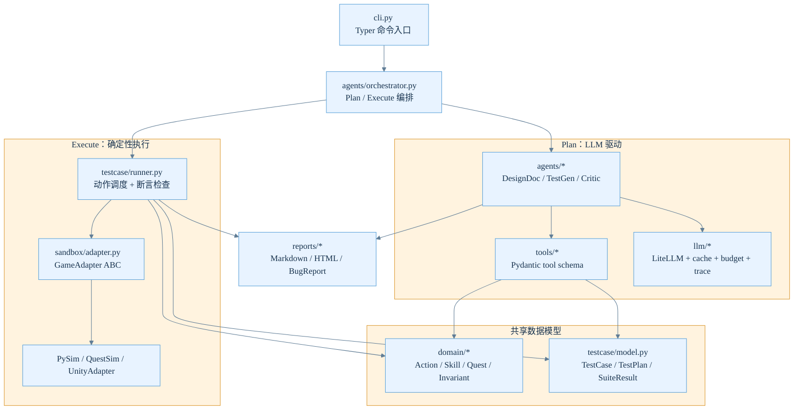
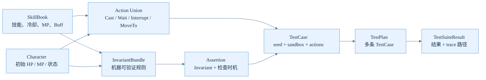
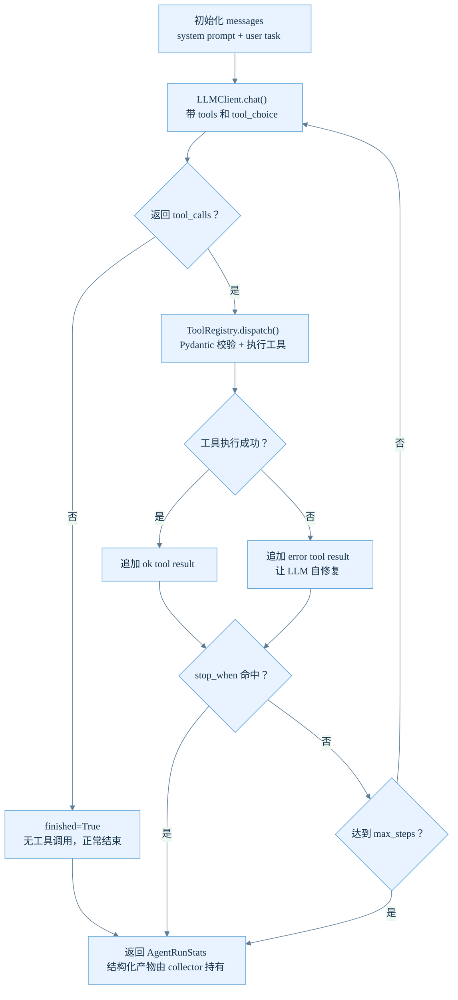
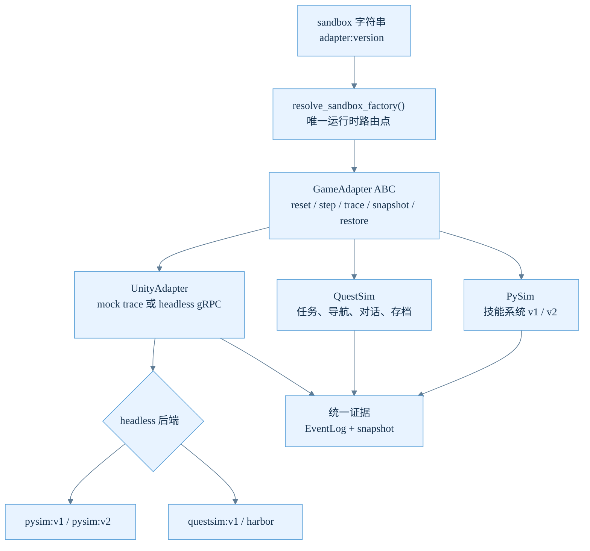
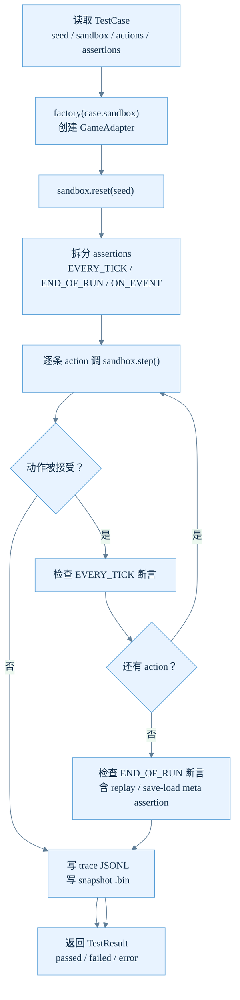

# GameGuard 技术文档

> 本文档面向工程师和面试官，深入阐述 GameGuard 的架构设计和 Agent 实现细节。
> 阅读前建议先浏览 [README.md](../README.md) 了解项目全貌。

---

## 目录

1. [整体架构](#1-整体架构)
2. [领域模型](#2-领域模型)
3. [LLM 网关层](#3-llm-网关层)
4. [Agent 引擎：AgentLoop](#4-agent-引擎agentloop)
5. [Agent 设计详情](#5-agent-设计详情)
   - [DesignDocAgent](#51-designdocagent)
   - [TestGenAgent](#52-testgenagent)
   - [TriageAgent](#53-triageagent)
   - [CriticAgent](#54-criticagent)
   - [ExploratoryAgent](#55-exploratoryagent)
6. [Orchestrator：管线编排](#6-orchestrator管线编排)
7. [沙箱抽象](#7-沙箱抽象)
8. [Runner 与断言系统](#8-runner-与断言系统)
9. [已知限制与迁移路径](#9-已知限制与迁移路径)

---

## 1. 整体架构

GameGuard 的架构由 8 层组成：

```
CLI (cli.py)                        ← Typer 子命令，thin controller
    │
Orchestrator (agents/orchestrator)  ← plan-and-execute 编排
    │
Agent Layer (agents/*)              ← 5 个 Agent，共享 AgentLoop
    │
LLM Gateway (llm/)                  ← LiteLLM 多 provider + Cache + Trace + Budget
    │
Test Runner (testcase/runner)       ← 确定性执行引擎
    │
Sandbox Adapter (sandbox/adapter)   ← GameAdapter ABC
    │
Domain Model (domain/*)             ← Pydantic 纯数据
    │
Reports (reports/*)                 ← Markdown / HTML / Jinja2
```

核心设计原则：

- **数据驱动**：TestCase/TestPlan 是 YAML/JSON，不是 Python 函数。LLM 产出和人类手写共用一个数据结构。
- **Plan-and-execute 分离**：Plan 阶段走 LLM（昂贵、有随机性），产物落 YAML 可缓存复用。Execute 阶段纯确定性（同 seed = 同 trace）。
- **Adapter 隔离**：Agent 和 Runner 只对 `GameAdapter` 协议讲话，具体实现（PySim/QuestSim/Unity headless）可互换。

下面这张图按代码包边界展示依赖方向。关键点是：Agent 只生产结构化产物，Runner 只消费 TestPlan，
沙箱只暴露 Adapter 协议，报告层只读结果和证据。



---

## 2. 领域模型

### 2.1 Invariant DSL — 19 种机器可验证不变量

不变式是整个系统最核心的领域抽象。每条 invariant 是纯数据（Pydantic discriminated union），按 `kind` 字段自动选定子类型。

**为什么用 registry 而不是让 LLM 生成代码**：
- LLM 安全：Agent 无法往 invariant 里注 `exec`
- 类型安全：mypy 能抓 evaluator 签名错误
- 可观测：invariant 序列化成 JSON 后原样进报告

**技能系统（9 种）**：

| Kind | 含义 | 关键字段 |
|---|---|---|
| `hp_nonneg` | HP 始终 ≥ 0 | `actor` |
| `mp_nonneg` | MP 始终 ≥ 0 | `actor` |
| `cooldown_at_least_after_cast` | 施法后冷却 ≥ 期望值 | `actor, skill, expected_cooldown` |
| `buff_stacks_within_limit` | 叠层 ≤ 上限 | `actor, buff, max_stacks` |
| `buff_refresh_magnitude_stable` | 刷新不会撑大 magnitude | `actor, buff, expected_magnitude` |
| `interrupt_clears_casting` | 打断后 casting_skill 为 None | `actor` |
| `interrupt_refunds_mp` | 打断退蓝 | `actor, skill` |
| `dot_total_damage_within_tolerance` | DoT 总伤可预测 | `actor, buff, expected_total` |
| `replay_deterministic` | 同 seed 两次跑 trace 一致 | 无需特殊参数 |

**QuestSim（10 种）**：`quest_step_reachable` / `quest_step_once` / `quest_no_orphan_flag` /
`trigger_volume_fires_on_enter` / `npc_respawn_on_reset` / `save_load_round_trip` /
`path_exists_between` / `no_stuck_positions` / `dialogue_no_dead_branch` /
`interaction_range_consistent`

**Evaluator 注册机制**（`domain/invariant.py:266-284`）：

```python
_REGISTRY: dict[str, Evaluator] = {}  # kind → evaluator function

def register(kind: str):
    def deco(fn): _REGISTRY[kind] = fn; return fn
    return deco

def evaluate(inv, view, log) -> InvariantResult:
    return _REGISTRY[inv.kind](inv, view, log)
```

每种 kind 对应一个 `@register("kind_name")` 装饰的 Python 函数，接收 `(invariant, StateView, EventLog)` → 返回 `InvariantResult(passed, message, witness_tick, actual, expected)`。

### 2.2 测试用例数据模型

`TestCase` 是纯 Pydantic，不包含任何执行逻辑：

```python
class TestCase(BaseModel):
    id: str                  # 稳定、人类可读的 ID
    name: str                # 报告标题
    seed: int = 42           # RNG 确定性锚点
    sandbox: str = "pysim:v1"  # <adapter>:<version>
    timeout_ticks: int = 10_000
    actions: list[Action]    # 动作序列（Cast/Wait/Interrupt/MoveTo...）
    assertions: list[Assertion]  # Invariant + 检查时机 + 可选参数
    strategy: TestStrategy   # CONTRACT / EXPLORATORY / PROPERTY / HANDWRITTEN
```

**为什么不开 Python 函数驱动**：传统 pytest 写法中一个测试 = 一个函数，LLM 难以凭空生成、回归 diff 难定位、策划/QA 看不懂。数据驱动让 LLM 以 JSON 产出（通过 tool-calling 提交），人也能直接写 YAML，两者对 Runner 完全无差别。

领域对象之间的关系可以理解为一条从“策划规则”到“可执行证据”的数据链：



### 2.3 断言检查时机

```python
class AssertionWhen(str, Enum):
    EVERY_TICK = "every_tick"   # 每个 action 后检查（开销大，但抓瞬态违规）
    END_OF_RUN = "end_of_run"   # 用例跑完后检查（开销最小）
    ON_EVENT = "on_event"       # 特定事件发生时检查（预留给 DoT/trigger 场景）
```

---

## 3. LLM 网关层

`llm/client.py` 是对 LiteLLM 的精良封装，所有 LLM 调用都走这里。

### 3.1 Provider 无关路由

通过 `_resolve_provider(model)` 把 `provider/model` 字符串翻译给 LiteLLM：

```python
# 直接走 LiteLLM 原生支持
"deepseek/deepseek-chat"   → ("deepseek/deepseek-chat", {})
"zai/glm-5.1"              → ("zai/glm-5.1", {})

# 走 OpenAI-compatible endpoint（新模型名早于 LiteLLM registry）
"deepseek-v4/deepseek-v4-pro" → ("openai/deepseek-v4-pro", {api_base, api_key})
```

### 3.2 三重护栏

```
请求 → LLMCache（命中直接返回，不花钱）
      → Budget 预判（USD + Token 双层）
      → LiteLLM.completion()
      → 回写 Cache + Trace + 记账
```

- **Cache**：请求内容 hash 做 key，同请求不重复调用。`GAMEGUARD_DETERMINISTIC=1` 时强制命中。
- **Budget**：`GAMEGUARD_USD_BUDGET` 主控 + `GAMEGUARD_TOKEN_BUDGET` 保底。
- **Trace**：每次 LLM 调用 JSONL 落盘，事后可完整复盘 Agent 决策链。

### 3.3 推理模型治理

```python
# GLM-4.7/5.1 的 thinking 关闭
disable_thinking=True → extra_body={"thinking": {"type": "disabled"}}

# GPT-5.5 的 reasoning effort 控制
reasoning_effort="none" → 关闭推理链输出
```

推理型模型在 tool-calling 场景下的核心风险：`max_tokens` 全部消耗在 `reasoning_content` 上，
`tool_calls` 输出空数组——静默冻结。GameGuard 的解决策略：
- `max_tokens=8192` 留足余量
- DesignDocAgent 使用 `tool_choice="required"` 强制每轮调工具
- `stop_when` 回调在 `finalize` 后立即退出，防止强制调工具导致的多余调用

---

## 4. Agent 引擎：AgentLoop

`agents/base.py` 中的 `AgentLoop` 是所有 Agent 共用的 tool-calling 循环。
约 200 行，不依赖 LangChain/LangGraph。

### 4.1 核心机制

```python
class AgentLoop:
    client: LLMClient       # LLM 调用统一入口
    tools: ToolRegistry     # 工具注册表
    max_steps: int = 20     # 硬上限防死循环
    tool_choice: str | None # None=auto, "required"=强制调工具
    stop_when: Callable     # 收敛回调，典型: lambda r: r.ok and r.tool_name == "finalize"
```

循环体：

```
for step in range(max_steps):
    resp = client.chat(messages, tools, tool_choice)
    messages.append(assistant_message(resp))

    if resp.finished:        # 无 tool_calls → LLM 认为结束
        return stats

    for tc in resp.tool_calls:
        result = tools.dispatch(tc.name, tc.arguments)
        messages.append(tool_result_message(result))

        if stop_when(result):  # finalize 等收敛信号
            return stats
```

### 4.2 关键设计决策

AgentLoop 的状态机很小，但边界条件都显式可控：什么时候继续问模型、什么时候把工具错误交回模型自修复、什么时候立即停止。



**为什么不依赖 LangChain**：手写 ~200 行，边界行为全在控制范围内。出问题直接 debug 这里的循环体，
不需要跨库追信号链。

**策略无关**：同一个循环体支持 ReAct（交替 Thought→Action→Observation）和
plan-and-execute（第一轮出 plan，后续执行和复盘）。区别在 prompt 和 tool 集合上。

**错误反馈闭环**：工具执行失败时，`ToolInvocationResult(ok=False, error_kind=..., content=...)`
被塞回消息历史。LLM 看到错误可以自修复（"JSON 解析失败？我重发一次"），这是 ReAct 论文验证过的有效模式。

**parallel tool_calls**：LLM 一轮返回多个 tool_call，AgentLoop 逐个执行并把结果回塞。
DesignDocAgent 借此一轮 emit 若干条 invariant，显著节省步数。

### 4.3 收敛条件（优先级）

1. `stop_when` 返回 True（最优先，典型场景：`finalize` 被调用）
2. LLM 返回 `finished=True`（没有 tool_calls）
3. `max_steps` 达到上限

---

## 5. Agent 设计详情

### 5.1 DesignDocAgent

**职责**：读策划 Markdown → 产出 `InvariantBundle`（一批机器可验证不变式）。

**设计模式：Collector + emit 工具**

```python
class _Collector:
    items: list[Invariant]       # 运行时积累的不变式
    rationales: dict[str, str]   # 每条不变式的来源说明

def _build_emit_tool(collector):
    def _emit(args: EmitInvariantInput) -> EmitResult:
        inv = TypeAdapter(Invariant).validate_python(args.invariant)
        collector.items.append(inv)       # 通过闭包写入外部 state
        return EmitResult(ok=True, ...)
    return Tool(name="emit_invariant", fn=_emit)
```

Collector 通过闭包捕获——工具是薄壳，状态在外部。每次 `run()` 创建新 collector 实例，状态不串线。

**为什么选 tool-calling 而非 structured output**：
1. Schema 校验失败时 LLM 能自修复
2. trace 里能看到每条 invariant 怎么生成的
3. 单条 emit 失败不污染其他
4. 同一轮可并行 emit 多条（省步数）

**内联优化**：≤220 行的短文档直接嵌入 user message，跳过 `list_docs`/`read_doc_section` 工具。
当所有文档都内联时，文档读取工具完全不注册——把宝贵的 20 步全留给 emit。

**System Prompt 关键条目**：
- 要求使用文档数据表中的具体 ID（`p1`/`dummy`/`skill_fireball`），禁止占位符
- 提供"常见展开规则"：cooldown 按技能表展开、target/self buff 的 actor 不同、interrupt 只对 cast_time>0 展开
- 强制读完数据表后"必须开始 emit"
- 鼓励 parallel emit

### 5.2 TestGenAgent

**职责**：把 `InvariantBundle` + 静态游戏数据（技能/角色）编译成沙箱可执行的 `TestPlan`。

**为什么不写个 convert 函数**："契约 → 测试"看起来机械，但细节很吃游戏直觉：
- 测 cooldown 要算对 casting 时长
- 测 interrupt 退款要在 cast 窗口内打断
- 测 buff refresh 要等两次 CD 才能让 refresh 真的发生
LLM 比规则引擎更擅长处理这种"同时满足多个数值约束"的推理。

**Discovery vs Prefetch 双模式**：

| | Discovery（默认） | Prefetch |
|---|---|---|
| user message | 仅任务说明 | 嵌入完整 invariants + skills + characters |
| LLM 行为 | 调 list_invariants → list_skills → list_characters | 跳过 list_* 直接 emit |
| 步数 | +3 | 基线 |
| Token | +4% | 基线 |
| Trace 质量 | 完整，能讲故事 | 省 token |
| 适用场景 | Demo / 演示 | CI / GLM-4.7 fallback |

两种模式共用相同代码、工具、prompt。Prompt 里都写着"先读三个 list_\*"，
prefetch 下 LLM 发现数据已经在 message 里了，自然就跳过工具调用——符合
OpenAI/DeepSeek 的 tool-calling 协议语义。

**System Prompt 关键条目**：
- 具体约束：MP 初始 100，Focus 20 + Ignite 40 + Fireball 30 = 90，最多 2-3 次施法
- 动作序列模板：cast 完成 / CD 独立性 / buff refresh / interrupt 退款 / HP/MP 非负
- 合并指导：一条用例可覆盖多条相关 invariant（例如 smoke-fireball 同时查 HP/MP 非负）
- 鼓励同轮 parallel emit

### 5.3 TriageAgent

**职责**：把 `TestSuiteResult` 中分散的失败用例聚类成 Jira 兼容 `BugReport` 列表。

**两阶段聚类**：

**阶段 1 — 规则阶段**（`tools/triage_tools.py::cluster_failures`）：
- FAILED 按 `(invariant_kind, actor, skill)` 分组
- ERROR 按 error_message 前 80 字符 hash 分组
- 确定性、零 LLM 成本

**阶段 2 — LLM 阶段**（`agents/triage.py`）：
- 审查候选簇，判断是否需要拆分（一个簇混了不同 bug）或合并（跨簇同根）
- 写中文标题、复现步骤（3-5 条）、判严重级（S0-S3）
- 按需调 `read_trace_tail` 拉 trace 末尾（不塞全量，防止 prompt 爆炸）

**为什么必须 LLM 参与、不能纯规则**：
规则无法检测跨 invariant 的同根 bug（例：BUG-001 同时让 cooldown 测试 FAIL 和 buff refresh 测试 ERROR）。
模板化的标题和复现步骤也不好读。LLM 在这里的价值是跨规则关联 + 自然语言解释 + 上下文敏感严重级判断。

**Short-circuit**：没有失败时直接返回零步数空输出，不调 LLM。

**保守合并策略**：从真实实验中学到的教训——LLM 曾把 BUG-002（cooldown）和 BUG-004（DoT）
错误合并为一条。"宁可漏聚也不要乱聚"已写入 system prompt。

### 5.4 CriticAgent

**职责**：在 TestPlan 执行前审查，修复或删除 LLM 生成的可预期出错用例。

**边界严格**：
- 不新增 case（新增交给 TestGen 或 Exploratory）
- 不修改 `assertion_invariant_ids`（那是测试目标，不是错）
- 只做三件事：`accept` / `patch` / `drop`

**分工原则**：静态校验在工具层（Python 算 MP 预算、CD 违规、wait 时长），
LLM 只看预计算诊断结果做决策。不让 LLM 算数——那是 Python 的事。

**review_hook 注入点**：`make_critic_review_hook(...)` 返回 `Callable[[TestPlan], TestPlan]`，
直接注入 orchestrator 的 `review_hook=` 参数。Orchestrator 从 D5 就预留了这个 hook，
Critic 接入零改动。

**System Prompt 关键条目**：
- Patch 模板：CD 违规 → 插 `wait(cooldown + 0.1)`；MP 不足 → 删额外 cast
- 显式测试"CD 内施法应被拒"的 case → 调 `drop_case`（依赖 sandbox 的 ERROR 路径而非 wait 时长）
- 鼓励保留尽可能多的 case
- patch > drop

### 5.5 ExploratoryAgent

**职责**：生成对抗式测试用例，模拟"恶意玩家"尝试让 invariant 变红。

**核心设计：同工具，不同 prompt**。使用与 TestGenAgent 完全相同的工具集
（`list_invariants` / `list_skills` / `list_characters` / `emit_testcase` / `finalize`），
区别仅在 system prompt 的思考方式。为什么不加开关？因为契约和对抗的思维完全不同，
塞开关会让 prompt 又长又割裂。

**对抗模板**：
- A: 状态机边界 — 立刻打断后立刻重开新 cast
- B: 资源耗尽 — 连续 cast 到 MP 归零
- C: Buff 刷新边界 — 在即将过期的最后一 tick 重施
- D: CD 边界 — `wait(cooldown - dt)` 应被拒；`wait(cooldown + dt)` 应通过
- E: 多 buff 叠加 — 同时持 3 种 buff
- F: 打断后冷却 — 打断长技能后立刻重施同技能（v1 黄金 = 不进 CD）

所有产出 case 的 `strategy` 被标记为 `TestStrategy.EXPLORATORY`，报告层可区分。

---

## 6. Orchestrator：管线编排

`agents/orchestrator.py` 是工作流编排层，只有 ~120 行。

### Plan 阶段

```python
def run_plan_pipeline(*, doc_paths, skill_book, initial_characters, llm, ...):
    # 1) DesignDocAgent → InvariantBundle
    dd = run_design_doc_agent(doc_paths=doc_paths, llm=llm)

    # 2) TestGenAgent → TestPlan
    tg = run_test_gen_agent(bundle=dd.bundle, skill_book=skill_book, ...)

    # 3) 可选 Critic review
    if review_hook: plan = review_hook(tg.plan)

    return PipelineResult(invariants=dd.bundle, plan=plan)
```

### Execute 阶段

```python
def run_execute_pipeline(*, plan, factory, llm=None, do_triage=True, ...):
    suite = run_plan(plan, factory=factory)          # Runner 确定性执行

    if not do_triage or not suite.has_failures:
        return ExecuteResult(suite=suite, triage=None)

    tr = run_triage_agent(suite=suite, llm=llm)      # 只有失败时才调 LLM
    return ExecuteResult(suite=suite, triage=tr.output)
```

### 设计意图

Orchestrator 刻意做薄：它的存在不是为了封装"串行"这件事，而是为 D7（Triage）、
D9（回归 diff）、D10（Critic）预留扩展点。把编排职责放在 `orchestrator.py` 而非
堆进 `cli.py`，让 CLI 保持 thin controller 的角色。

---

## 7. 沙箱抽象

### GameAdapter ABC

```python
class GameAdapter(ABC):
    @abstractmethod
    def reset(self, seed: int) -> SandboxState: ...
    @abstractmethod
    def step(self, action: Action) -> StepResult: ...
    @abstractmethod
    def state(self) -> SandboxState: ...
    @abstractmethod
    def trace(self) -> EventLog: ...
    @abstractmethod
    def snapshot(self) -> bytes: ...
    @abstractmethod
    def restore(self, snap: bytes) -> None: ...
```

6 个方法，这个接口保持稳定。Agent 和 Runner 只对 `GameAdapter` 讲话，
具体实现（PySim/QuestSim/Unity headless）由 `cli.py::resolve_sandbox_factory` 字符串路由。



### PySim v1/v2 双版本设计

- **v1**：黄金实现（无 bug）。4 个技能 + 3 种 Buff + 暴击。~1,000 行确定性离散仿真。
- **v2**：植入 5 类 bug（cooldown 偏移、buff refresh 漂移、DoT 系数 1.05、全局 RNG、状态机不清理）。

这是整个演示故事的核心机制：同一份 TestPlan 在 v1 上全 PASS，在 v2 上部分 FAIL。
Runner 的 replay 确定性验证（`_check_replay_determinism`）通过双跑同 seed 抓 BUG-005（全局 RNG）。

### QuestSim 扩展

任务状态机 + 3D 导航（NavGrid + A\*）+ 对话树（DialogueGraph）+ 触发器体积 + 实体系统。
可选 PyBullet 后端做真 3D 刚体物理。

### Unity gRPC 通路

`unity:headless` 模式下通过 gRPC 连接 Unity headless 进程，协议定义在 `.proto` 文件（7 个 RPC）。
mock server（`sandbox/unity/mock_server.py`）实现了完整的 request/response 回放，
无需真实 Unity 即可验证 gRPC 通路。

---

## 8. Runner 与断言系统

### 执行模型

单条用例执行时，Runner 是唯一调度者：沙箱只负责响应动作并追加事件，断言检查和证据落盘都在 Runner 侧完成。



```python
def run_case(case: TestCase, factory: SandboxFactory):
    sandbox = factory(case.sandbox)
    sandbox.reset(case.seed)

    for action in case.actions:
        step = sandbox.step(action)
        check EVERY_TICK assertions   # 每个 action 之后刷

    check END_OF_RUN assertions        # 全部 action 跑完
    write trace (JSONL) + snapshot    # 落盘证据
```

### 重放确定性验证

`_check_replay_determinism`（`runner.py:433-533`）是 BUG-005 的 oracle：

1. 同 seed 同 actions 跑两次 → 逐事件比对 event log
2. 比对字段：`kind / actor / target / skill / buff / amount / meta`，浮点 round(6)
3. **关键检测**：trace 中有 crit 事件但 `rng_draws == 0` → 说明 sandbox 内部在用全局
   `random.random()` 而非注入的 seed RNG。即使两次跑偶然一致，这个指纹暴露了确定性破坏的根因。

---

## 9. 已知限制与迁移路径

### TestGen v2 bug recall 天花板 80%

所有模型在 TestGen 上的 v2 bug 召回全部卡在 80%。BUG-002（cooldown isolation）是系统性问题盲区——
没有模型能在 <12 条用例下抓到它。不是模型能力问题，是任务本身的难度。

### DeepSeek V4 API 过渡期

DeepSeek V4（2026-04-24 发布）的 API 当前处于过渡期：模型名路由到旧的 `deepseek-reasoner` 端点，
而 reasoner 不支持 `tool_choice`。唯一 workaround 是 `disable_thinking=True`（GLM 参数名，
DeepSeek API 恰好兼容）。原生 `thinking_mode` + `reasoning_effort` 基础设施已就绪，
预计 2026-07-24 旧端点停用后可切换。

### GLM-4.6 多轮 tool-calling 协议错乱

第 3 步后返回 XML 格式 tool_call arguments（非 JSON），LiteLLM 未归一化，Pydantic 校验全部拒绝。
目前 GLM-4.6 已从模型对比池中排除。

### DesignDoc 区分度不足

GPT-5.5 / GPT-5.4 / GLM-5.1 / DS-V4-Pro 四家已达到 100% recall + 100% precision 天花板。
当前 40 条 golden（skill_v1 18 条 + advanced_skill_v2 22 条）区分度不够——
需要更复杂的策划文档来拉开差距。

### GLM-4.7 未重测

当前只确认了 GLM-5.1 开推理的改善。GLM-4.7 仍然是 `disable_thinking=True`，
可能也受益于开推理，待后续实验验证。

---

## 参考

- [Agent 效果评估汇总](../EVAL.md)
- [Prompt 工程迭代记录](prompt-engineering.md)
- [开发日志](dev-log.md)
- [模型对比实验](../evals/compare_models/results.md)
